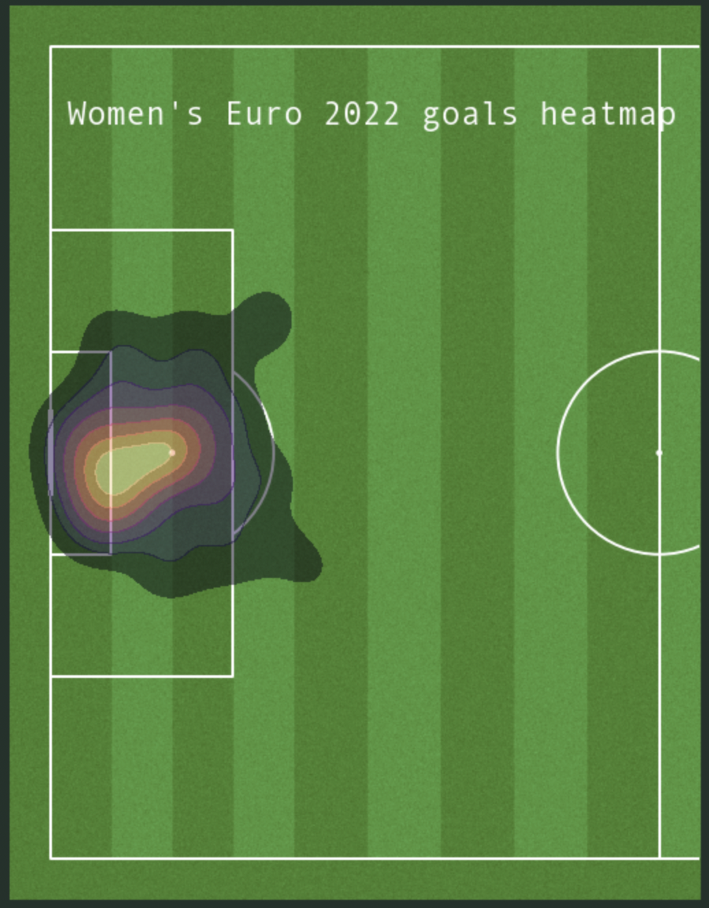
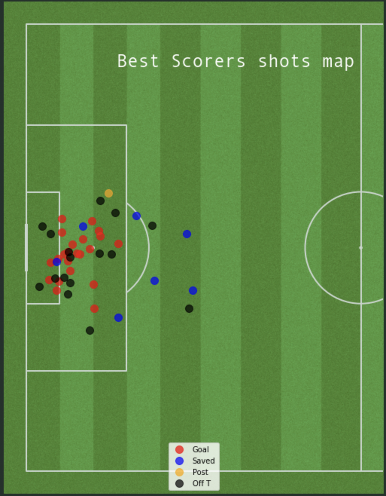

## Context
A few weeks after England won the 2022 Women's Euro, StatsBomb released open data of the tournament through their API. This repo contains some basic soccer data-visualization methods I implemented thanks to this data.

## Overview

- Connecting with StatsBomb API and extracting open data about the tournament
- Plotting a heatmap of the goals scored at the tournament
- A closer look on the shots attempted by the top5 scorers of the tournament, plotting a map beaked down by the differents outcomes (Off target,Saved,Goal,Post etc...).
- England's Keira Walsh was named Women's EURO 2022 final Player of the Match, the midfielder recorded an assist in the final and the greatest pass accuracy rate throughout the tournament, at last I plotted a quick passmap of all her passes in the final.

## Some results

  
